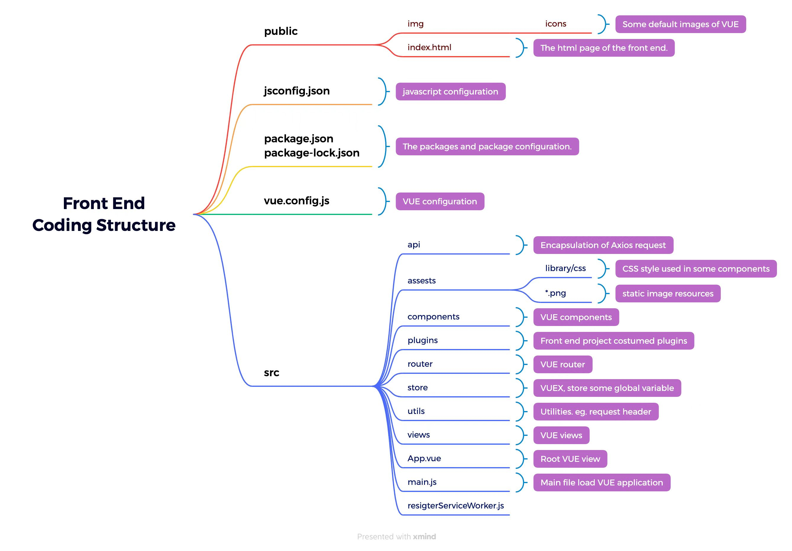
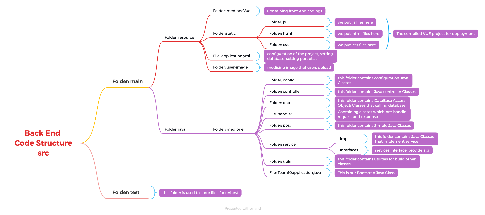

# ITProject010
This is a project from team10 COMP30022 IT-project_2022.

Supervisor: Atie Asadikia

Client: 	Bai, Zhongyi

# Team Member:

| Name  | Email |
|---|---|
| Zijie Su  | zisu1@student.unimelb.edu.au |
| Zhaolong Meng  | zhaolongm@student.unimelb.edu.au |
| Yingge Sun  | yingges@student.unimelb.edu.au |
| Yuchen Cao  | yuccao@student.unimelb.edu.au |
| Tianjin Zhao  | tianjinz@student.unimelb.edu.au |

# Project Description
1. Product Overview:

    Medicine One is a website that helps users manage their medicines(or health supplements) by storing basic information about the medication.

2. Product Target Users: 

    Our client has stated that he expects the application targets general users, which is reasonable since almost everyone buys medicines and wants a product that manages their purchases. 

3. Scope of the Product: 

    * Medicine One is a medicine record system, like a medicine memo, that records the medicines the user purchases.

    * Users could sign up for an account using their email.

    * Most users log into the site from their mobile phones, but other devices should also be considered. Users can log in to the same account using multiple devices simultaneously.

    * Users can add purchased medicine and their information to their repository. (CRUD of medical records) and can search for them afterwards.

    * Users can also create multiple medicines repositories, as users may have medicines in various locations (such as offices, schools, and other houses under their names). If they record multiple locations, they can also determine if the drug is still available at different places and how much remains. 

# Code Structure
### Front End Code Structure
* The root path of front end project is `./scr/main/resources/medioneVUE/medicine-one/`

### Back End Code Structure

